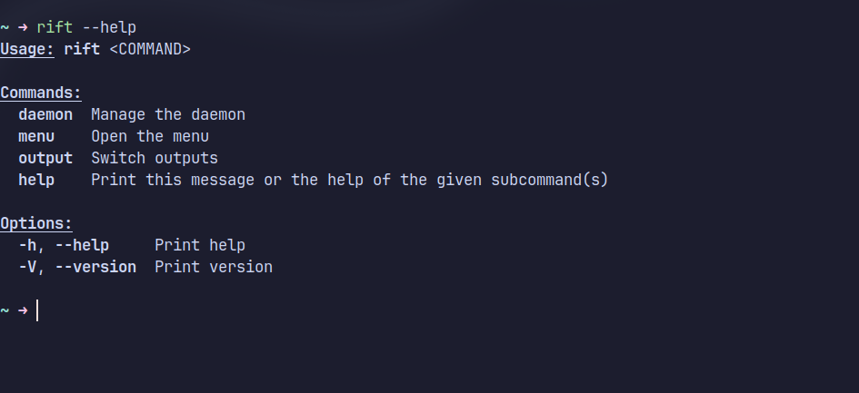

# Rift
An application to detect HDMI changes in Hyprland.

# Requirements
- Linux (Does NOT work on Windows/Mac)
- [Hyprland](https://github.com/hyprwm/Hyprland) as DE
- [Eww](https://github.com/elkowar/eww)

Please make sure you have these installed.

Change monitor settings in monitor.rs. \
This was tested on Arch Linux, but should work fine on other distros.
